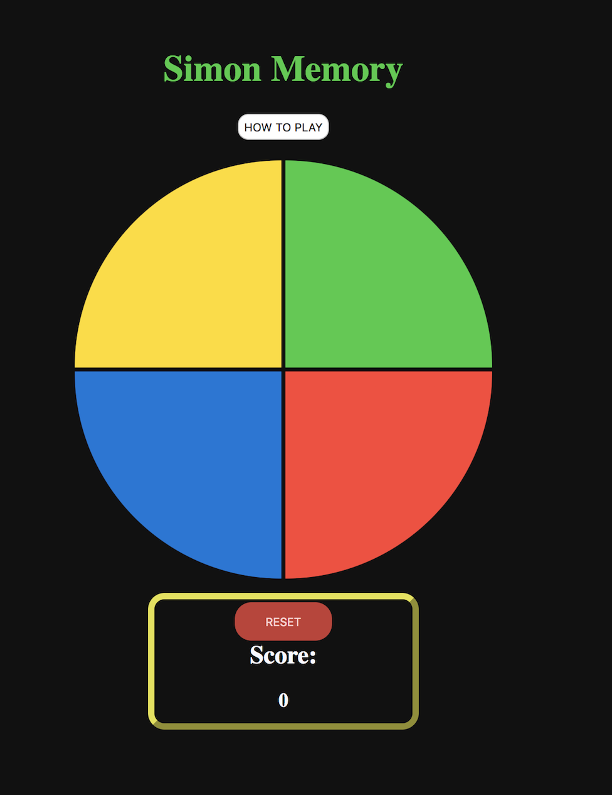

## Simon Memory Game

---

## Description

Simon is a game of memory in which the player has to test his ability in replicating the sequence order of colors.

---

## Example

---

## Technologies Used

- Html
- CSS
- Javascript

---

## Features

- Interactive Game Sequence

- Score tracker

- Reset feature

---

## Planned features

- Adding difficulty setting
- Mobile compatible
- Start feature / multiplayer
